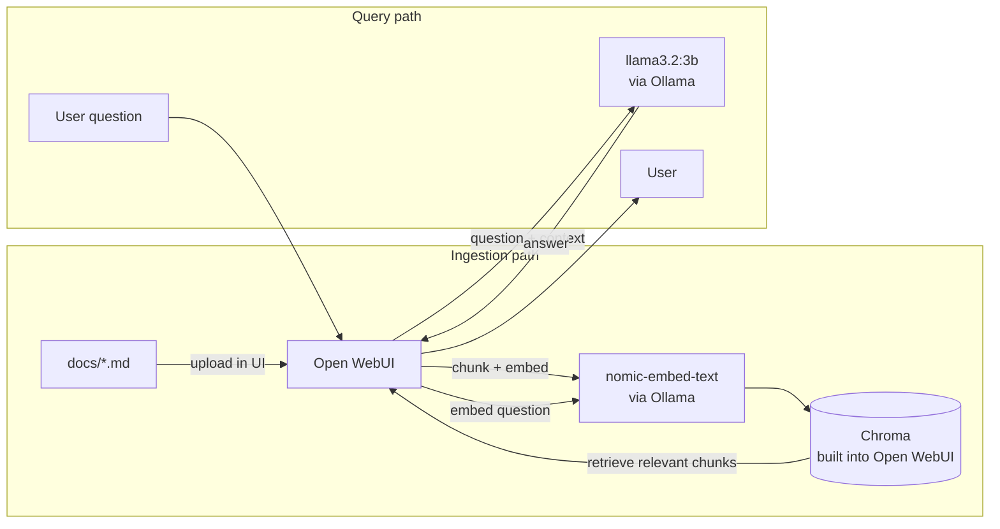

# mentr

**mentr** is your local work body. You can ask a chat interface questions about internal documentation instead of hunting for
it themselves. Everything runs on your own machine — no cloud, no external API calls, no data leaves your laptop.

This repo is a companion to my blog post about  [mentr - your local work buddy](https://phillipsteinert.de/blog/onboarding-assistant-local-rag-ollama). It deploys
[Ollama](https://ollama.com/) (running the `llama3.2:3b` chat model and
the `nomic-embed-text` embedding model) and
[Open WebUI](https://openwebui.com/) (chat frontend with a built-in
knowledge-base / RAG feature) into a Kubernetes cluster, wired
together with [Kustomize](https://kustomize.io/).

The example knowledge base (`docs/`) contains three fictional HR
process documents for a made-up company, "Example AG" — safe to
publish publicly, no real data.

## Setup

If you already have a running cluster, you can skip the k3d cluster create step

```bash
k3d cluster create mentr --agents 2 -p "8080:80@loadbalancer" --volume "$(pwd)/.ollama-models:/data/ollama-models@all"
```
```bash
kubectl apply -k kustomize/overlays
```

The first command creates a 3-node k3d cluster (1 server + 2 agents)
and bind-mounts the local `.ollama-models/` directory into every node, so
downloaded models survive cluster teardown. The second deploys Ollama,
Open WebUI, and a one-off Job that pulls both models. This runs on CPU
by default — see "GPU acceleration" below to use an NVIDIA GPU instead.

Model downloads take a few minutes. Watch progress with:

```bash
kubectl -n mentr logs -f job/mentr-ollama-model-init
```

Wait until it prints `Model pull complete.` (check with `kubectl -n
mentr get jobs` — `COMPLETIONS` should read `1/1`) before continuing
— Open WebUI will work before that, but chat responses will fail until
both models are pulled.

## Using it

1. Open [http://mentr.localhost:8080](http://mentr.localhost:8080) in your
   browser. Most browsers and OSes resolve `*.localhost` to `127.0.0.1`
   automatically; if yours doesn't, add `127.0.0.1 mentr.localhost` to
   `/etc/hosts`.
2. Complete the sign-up form — the first account created becomes the
   admin. This is a purely local instance, so any email/password works.
3. Go to **Workspace > Knowledge**, create a new collection (e.g.
   "HR Docs"), and upload the three files from `docs/`
   (`sick-leave.md`, `vacation-planning.md`, `working-hours.md`).
4. Start a new chat, type `#` to reference your collection by name, and
   ask a question, for example:

   > From which day of illness do I need a doctor's note?

   The assistant should answer based on `docs/sick-leave.md` (4th
   consecutive day), not from general knowledge.

## Architecture



## GPU acceleration

The Ollama Deployment can use an NVIDIA GPU instead of CPU inference —
the pieces are already in the repo, just commented out by default:

1. In `kustomize/overlays/ollama/patch-resources.yaml`, uncomment the
   two `nvidia.com/gpu: "1"` lines (under `requests` and `limits`).
2. In `kustomize/overlays/ollama/kustomization.yaml`, uncomment the
   `nvidia-device-plugin.yaml` line in `resources:` — this deploys the
   NVIDIA device plugin DaemonSet, which is what makes `nvidia.com/gpu`
   schedulable at all.
3. Add `--gpus=all` to the `k3d cluster create` command above.

Requires an NVIDIA GPU (8+ GB VRAM comfortably covers `llama3.2:3b` +
`nomic-embed-text`), the NVIDIA driver, and the [NVIDIA Container
Toolkit](https://docs.nvidia.com/datacenter/cloud-native/container-toolkit/latest/install-guide.html)
with Docker configured to use the `nvidia` runtime, plus k3d v5.4.6+
for `--gpus` passthrough. If the Ollama pod stays `Pending` afterward,
run `kubectl -n mentr describe pod -l app=ollama` and check for
`Insufficient nvidia.com/gpu` — that means the device plugin hasn't
picked up the GPU yet, or the Container Toolkit isn't set up correctly
on the host.

## Deploying individual components

Each component (`ollama`, `webui`) has its own Kustomize target under
both `base/` and `overlays/`, so you can (re)deploy just one piece —
useful when iterating on, say, the Open WebUI image without touching
Ollama:

```bash
# Whole stack, generic (no GPU / local-specific settings)
kubectl apply -k kustomize/base

# Whole stack, local dev settings (CPU by default, see "GPU acceleration" above)
# (this is what the Setup section above runs)
kubectl apply -k kustomize/overlays

# Just Ollama + the model-pull Job
kubectl apply -k kustomize/base/ollama          # generic
kubectl apply -k kustomize/overlays/ollama      # hostPath PV + resource limits

# Just Open WebUI
kubectl apply -k kustomize/base/webui           # generic
kubectl apply -k kustomize/overlays/webui       # mentr.localhost ingress + resource limits
```

The component-only targets don't include the `mentr` Namespace
object — apply `kubectl apply -k kustomize/base/namespace` (or one of
the whole-stack targets above) at least once first.

## Teardown

```bash
k3d cluster delete mentr
# optional — also deletes the downloaded models:
rm -rf .ollama-models
```

## License

[MIT](LICENSE)
